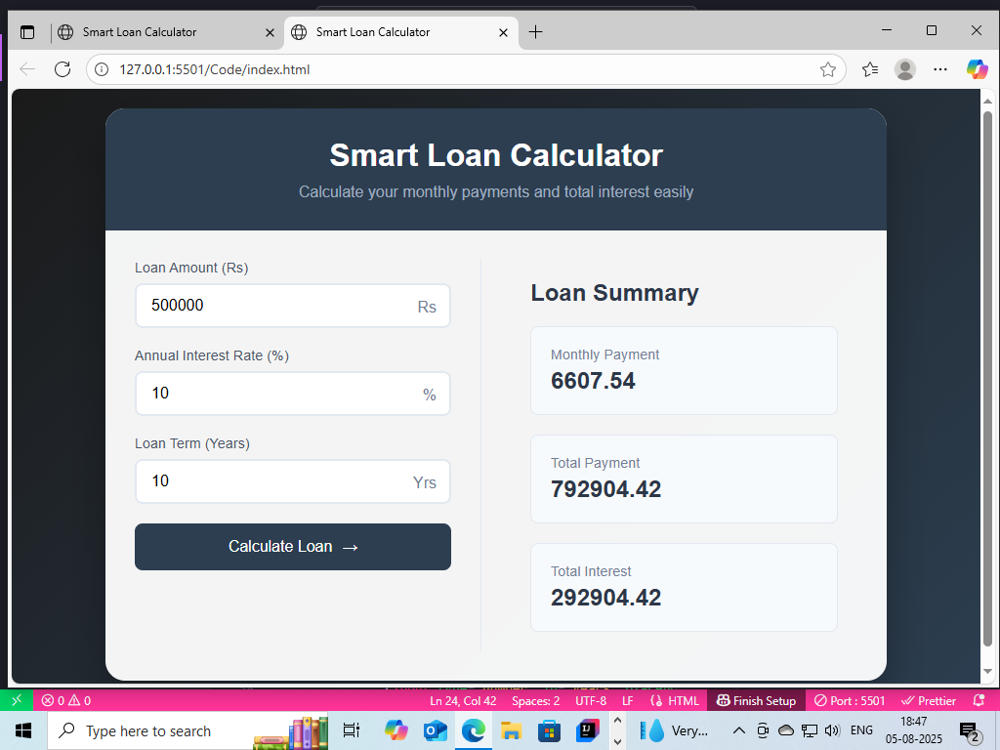

💰 Smart Loan Calculator

A modern and responsive loan calculator built with **HTML**, **CSS**, and **JavaScript**. Instantly calculate your monthly payments, total payment, and total interest on any loan.

---

🚀 Features

- 📥 Input loan amount, interest rate, and loan duration
- ⚡ Calculates:
  - Monthly Payment
  - Total Payment
  - Total Interest
- 💾 No backend required — all logic runs in the browser
- 🧮 Smooth animated number transitions
- 📱 Fully responsive layout

---

📂 Folder Structure

Smart-Loan-Calculator
├── README.md
├── Screenshots/
└── code/
├── index.html
├── styles.css
└── script.js

